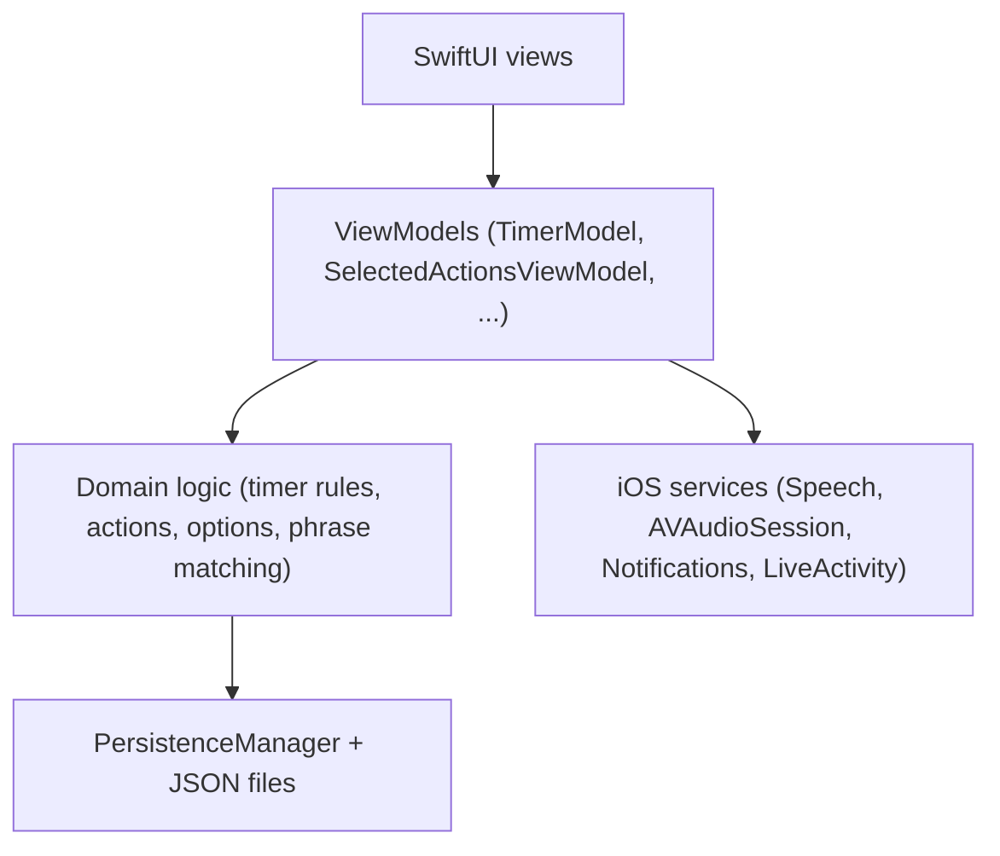

## Architecture Overview

### Layers

- **SwiftUI views** (`TimeForABreakSwiftUI/*.swift`, `Subviews/*.swift`)
  - Presentation only: compose UI, respond to user input, and bind to observable models.
  - Examples: `MainView`, `TimerCountView`, `SummaryView`, `OptionsView`, `SelectedActionsSheetView`, `TimerCompletionView`, `ActionSegmentRingView`.

- **View models / controllers** (`Data/*Model.swift`, `NotificationManager.swift`, `LiveActivityManager.swift`)
  - Own observable state and orchestrate between UI and domain logic.
  - Examples:
    - `TimerModel` – timer countdown, work/break mode, completion lifecycle.
    - `SelectedActionsViewModel` – today’s selected actions and completion history.
    - `ActionViewModel` – master catalog of all available actions.
    - `OptionsModel` – user preferences (durations, sound, ring behavior).
    - `NotificationManager`, `LiveActivityManager` – iOS service facades.

- **Domain logic (portable core)** (`Data/*.swift` that do not talk directly to iOS APIs)
  - Encapsulates timer rules, action selection, options semantics, and phrase matching.
  - Examples:
    - `TimerModel` (minus `@MainActor`/UI concerns) – work/break durations, background handling.
    - `BreakAction`, `ActionCategory`, `ActionCompletion` – action metadata and history.
    - `SelectedActionsViewModel.setTodaysActions`, `yesterdayActions`, `countedHistoryActions`.
    - `OptionSet` – structure and rules for preferences.
    - `PhraseMatching` – text → action resolution and quantity extraction (pure functions).

- **Persistence** (`PersistenceManager.swift`, `DataProvider.swift`)
  - JSON-based storage in the app’s documents directory.
  - File names:
    - `breakActions.data` – all available actions (`ActionViewModel`).
    - `selectedActions.data` – today’s selected actions (`SelectedActionsViewModel`).
    - `actionCompletions.data` – completion history.
    - `options.data` – user preferences (`OptionsModel`).

### Platform adapters (iOS-specific)

These types wrap iOS frameworks and should be mirrored with equivalent services on Android:

- `VoiceRecognitionService` – wraps `SFSpeechRecognizer` + `AVAudioEngine` for live speech-to-text.
- `NotificationManager` – wraps `UNUserNotificationCenter` for local notifications.
- `LiveActivityManager` + `BreakTimerAttributes` – ActivityKit live activities / Dynamic Island.

The Android app should provide analogous services (for example, using Android speech APIs and notification channels) and keep the domain logic (timer rules, action selection, phrase matching) behaviorally equivalent to this Swift implementation.

